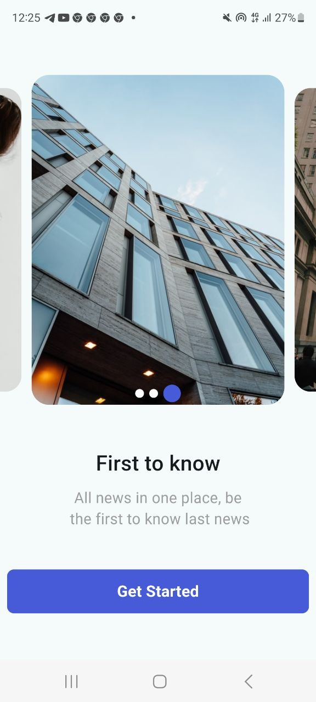
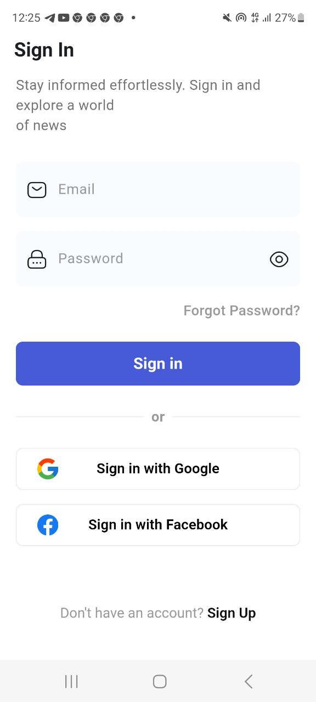
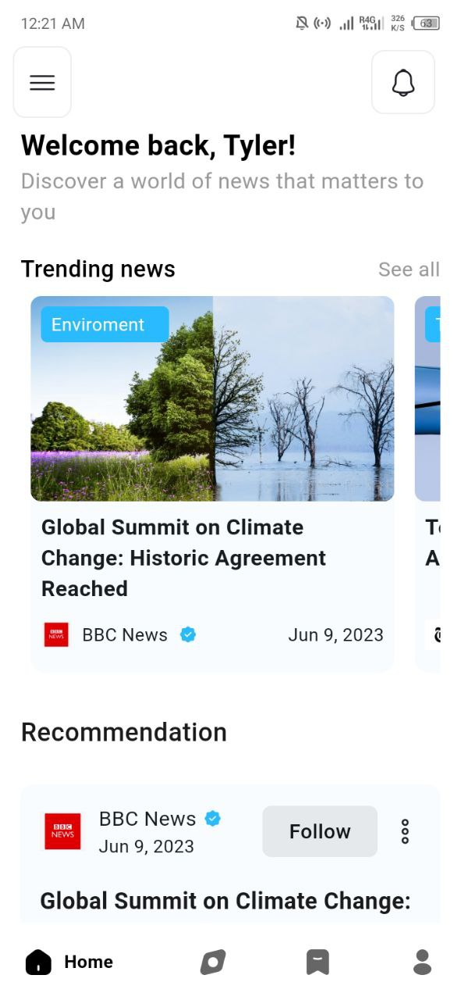
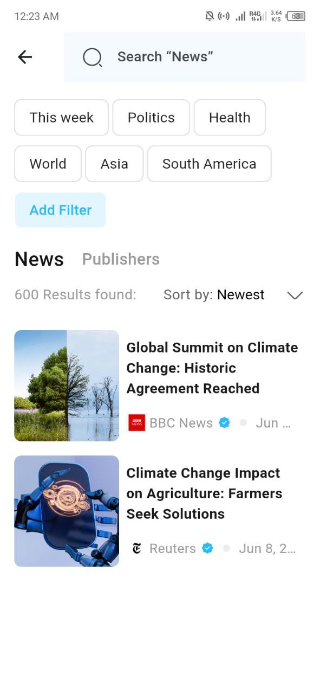
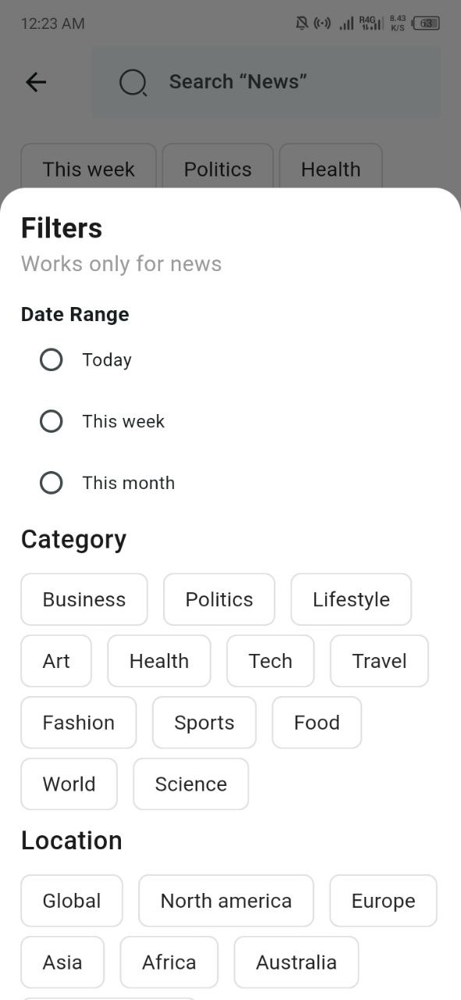
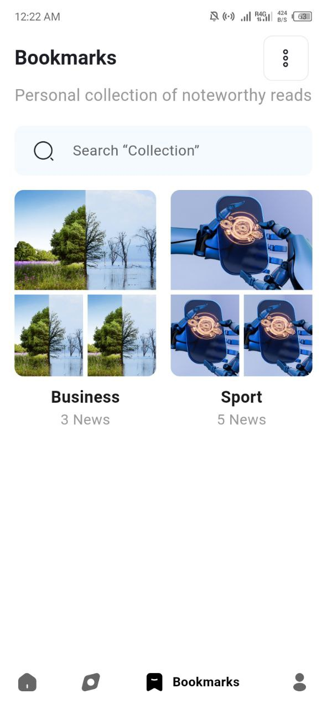
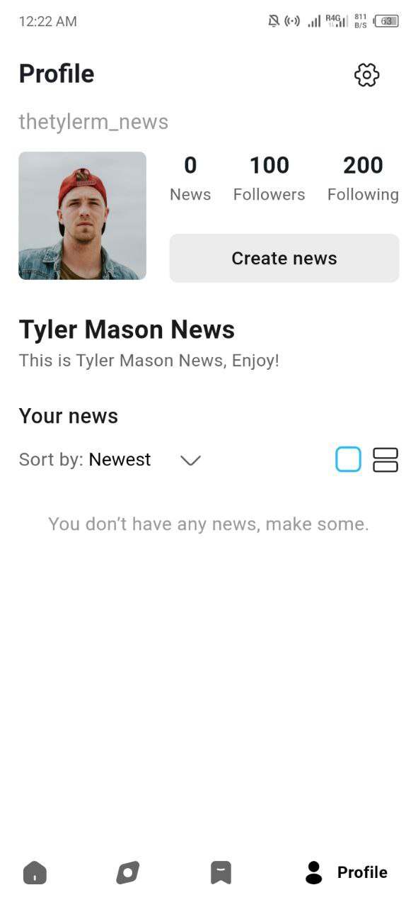

# Yours News


<div style="display: flex; padding: 10px;">
  
  
  
  
  
</div>
<div style="display: flex; padding: 10px;">
  
  
  
  
  
</div>

#### Project Structure

The project is organized into distinct feature modules, making it easy to navigate and scale as the app grows. 


## Structure

```

lib
│
├── core
│
├── features
│   ├── auth
│   │   ├── screen
│   │   ├── provider
│   │   ├── repository
│   │   └── widget
│   │
│   ├── bookmark
│   │   ├── screen
│   │   ├── provider
│   │   ├── repository
│   │   └── widget
│   │
│   ├── discover
│   │   ├── screen
│   │   ├── provider
│   │   ├── repository
│   │   └── widget
│   │
│   ├── home
│   │   ├── screen
│   │   ├── provider
│   │   ├── repository
│   │   └── widget
│   │
│   ├── profile
│   │   ├── screen
│   │   ├── provider
│   │   ├── repository
│   │   └── widget
│   │
│   ├── onboarding
│   │   ├── screen
│   │   ├── provider
│   │   └── widget
│   │
│   └── splash
│       └── screen
│
├── shared
│   ├── constant
│   ├── helper
│   ├── provider
│   └── widget
│
└── utils

main.dart

```

## State managment

For managing state across the app, I chose **Riverpod**. **Riverpod** offers a flexible and a greate way to handle state management in Flutter, and it allows for greater control and reactivity within the app. Its simplicity and the way it integrates with Flutter's widget tree made it the perfect choice for this project. With **Riverpod**, managing app-wide state is straightforward, and it ensures that the UI stays responsive and dynamic.


### Architecture & Scalability

The app is built with a feature-first approach. Each feature—like authentication, bookmarking, and profile management—has its own module containing screens, providers, repositories, and widgets. This modular setup makes the app easy to maintain and extend. As the app evolves, new features can be added seamlessly without disrupting existing functionality.


## Packages

- card_swiper
- flutter_carousel_widget
- iconsax_plus
- cached_network_image 
- shared_preferences
- dio
- dio_cookie_manager
- flutter_secure_storage
- google_nav_bar
#### For the test 
- mockito
- build_runner
#### linter
- flutter_lints
- riverpod_lint


